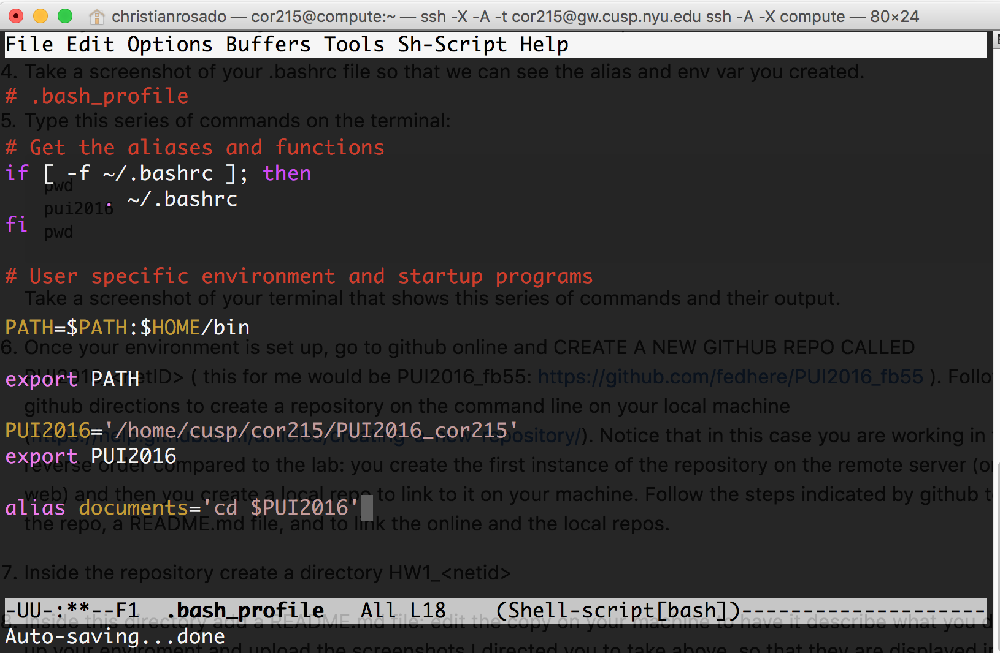

# PUI2016_cor215

Last login: Tue Sep 13 14:35:21 on ttys001
172-16-14-69:~ christianrosado$ ssh -X -A -t cor215@gw.cusp.nyu.edu ssh -A -X compute
#####################################################################
#                 Welcome to NYU CUSP gateway server                #  
#             All connections are monitored and recorded            #
#        Disconnect IMMEDIATELY if you are not an authorized user!  #
#                                                                   #
#                  WARNING------WARNING------WARNING                #
# PLEASE DO NOT  UPLOAD OR CREATE ANY FILE IN YOUR LOCAL DIRECTORY  #
# ON THIS SERVER (gateway server), ALL FILES OR FOLDERS ARE DELETED #
# WITHOUT WARNING.                                                  #  
#                                                                   # 
# The gateway server is only used as a secure door to CUSP Data     #
#            Facility and computing environment                     # 
#  Please go to http://datahub.cusp.nyu.edu to learn more about     # 
#  data transfer (upload/download)  to/from your CUSP home directory#          
#                  THANK YOU FOR YOUR COOPERATON                    # 
#                      CUSP FACILITY TEAM                           #
#####################################################################
cor215@gw.cusp.nyu.edu's password: 
Last login: Tue Sep 13 14:36:07 2016 from 192.168.72.191
You are using anaconda distribution with python 2.7.X
Oracle Client Environment Variables Enabled
[cor215@compute ~]$ ls
#.bash_profile#              Challenge_3_Solutions.ipynb  christian_github
Challenge_1_Solutions.ipynb  Challenge_4_Solutions.ipynb  PUI2016_cor215
Challenge_2_Solutions.ipynb  Challenge_5_Solutions.ipynb
[cor215@compute ~]$ cd PUI2016_cor215/
[cor215@compute PUI2016_cor215]$ pwd
/home/cusp/cor215/PUI2016_cor215
[cor215@compute PUI2016_cor215]$ ls
[cor215@compute PUI2016_cor215]$ cd ..
[cor215@compute ~]$ ls
Challenge_1_Solutions.ipynb  Challenge_4_Solutions.ipynb  PUI2016_cor215
Challenge_2_Solutions.ipynb  Challenge_5_Solutions.ipynb
Challenge_3_Solutions.ipynb  christian_github
[cor215@compute ~]$ pwd
/home/cusp/cor215
[cor215@compute ~]$ source .bash_profile
[cor215@compute ~]$ ls
Challenge_1_Solutions.ipynb  Challenge_4_Solutions.ipynb  PUI2016_cor215
Challenge_2_Solutions.ipynb  Challenge_5_Solutions.ipynb
Challenge_3_Solutions.ipynb  christian_github
[cor215@compute ~]$ documents
[cor215@compute PUI2016_cor215]$ ls
[cor215@compute PUI2016_cor215]$ ls -a
.  ..
[cor215@compute PUI2016_cor215]$ cd ..
[cor215@compute ~]$ ls -a
.               .cache                       .config             .kshrc
..              Challenge_1_Solutions.ipynb  .emacs              .local
.bash_history   Challenge_2_Solutions.ipynb  .emacs.d            .mozilla
.bash_logout    Challenge_3_Solutions.ipynb  .gnome2             PUI2016_cor215
.bash_profile   Challenge_4_Solutions.ipynb  .ipynb_checkpoints  .ssh
.bash_profile~  Challenge_5_Solutions.ipynb  .ipython
.bashrc         christian_github             .jupyter
[cor215@compute ~]$ emacs .bash_profile
[cor215@compute ~]$ source .bash_profile
[cor215@compute ~]$ PUI2016
[cor215@compute PUI2016_cor215]$ git remote add origin https://github.com/cor215/PUI2016_cor215.git
fatal: Not a git repository (or any parent up to mount point /gpfs1)
Stopping at filesystem boundary (GIT_DISCOVERY_ACROSS_FILESYSTEM not set).
[cor215@compute PUI2016_cor215]$ ls
[cor215@compute PUI2016_cor215]$ git init
Initialized empty Git repository in /gpfs1/cusp/cor215/PUI2016_cor215/.git/
[cor215@compute PUI2016_cor215]$ git status
On branch master

Initial commit

nothing to commit (create/copy files and use "git add" to track)
[cor215@compute PUI2016_cor215]$ git remote add origin https://github.com/cor215/PUI2016_cor215.gitv
[cor215@compute PUI2016_cor215]$ git push -u origin master
error: src refspec master does not match any.
error: failed to push some refs to 'https://github.com/cor215/PUI2016_cor215.gitv'
[cor215@compute PUI2016_cor215]$ echo "# PUI2016_cor215" >> README.md
[cor215@compute PUI2016_cor215]$ git init
Reinitialized existing Git repository in /gpfs1/cusp/cor215/PUI2016_cor215/.git/
[cor215@compute PUI2016_cor215]$ git add README.md
[cor215@compute PUI2016_cor215]$ git commit -m "first commit"
[master (root-commit) d56527c] first commit
 Committer: Christian Rosado <cor215@compute.cusp.nyu.edu>
Your name and email address were configured automatically based
on your username and hostname. Please check that they are accurate.
You can suppress this message by setting them explicitly. Run the
following command and follow the instructions in your editor to edit
your configuration file:

    git config --global --edit

After doing this, you may fix the identity used for this commit with:

    git commit --amend --reset-author

 1 file changed, 1 insertion(+)
 create mode 100644 README.md
[cor215@compute PUI2016_cor215]$ git remote add origin https://github.com/cor215/PUI2016_cor215.git
fatal: remote origin already exists.
[cor215@compute PUI2016_cor215]$ git push -u origin master
Username for 'https://github.com': cor215
Password for 'https://cor215@github.com': 
remote: Repository not found.
fatal: repository 'https://github.com/cor215/PUI2016_cor215.gitv/' not found
[cor215@compute PUI2016_cor215]$ git status
On branch master
nothing to commit, working directory clean
[cor215@compute PUI2016_cor215]$ git remote add origin https://github.com/cor215/PUI2016_cor215.git
fatal: remote origin already exists.
[cor215@compute PUI2016_cor215]$ git push -u origin master
Username for 'https://github.com': cor215
Password for 'https://cor215@github.com': 
remote: Repository not found.
fatal: repository 'https://github.com/cor215/PUI2016_cor215.gitv/' not found
[cor215@compute PUI2016_cor215]$ pwd
/home/cusp/cor215/PUI2016_cor215
[cor215@compute PUI2016_cor215]$ ls -a
.  ..  .git  README.md
[cor215@compute PUI2016_cor215]$ cd ..
[cor215@compute ~]$ ls
Challenge_1_Solutions.ipynb  Challenge_3_Solutions.ipynb  Challenge_5_Solutions.ipynb  PUI2016_cor215
Challenge_2_Solutions.ipynb  Challenge_4_Solutions.ipynb  christian_github
[cor215@compute ~]$ mv PUI2016_cor215/README.md .
[cor215@compute ~]$ ls
Challenge_1_Solutions.ipynb  Challenge_3_Solutions.ipynb  Challenge_5_Solutions.ipynb  PUI2016_cor215
Challenge_2_Solutions.ipynb  Challenge_4_Solutions.ipynb  christian_github             README.md
[cor215@compute ~]$ rm -rf PUI2016_cor215/
[cor215@compute ~]$ mkdir PUI2016_cor215
[cor215@compute ~]$ cd PUI2016_cor215/
[cor215@compute PUI2016_cor215]$ cd -
/home/cusp/cor215
[cor215@compute ~]$ mv README.md PUI2016_cor215/
[cor215@compute ~]$ cd PUI2016_cor215/
[cor215@compute PUI2016_cor215]$ ls
README.md
[cor215@compute PUI2016_cor215]$ git init 
Initialized empty Git repository in /gpfs1/cusp/cor215/PUI2016_cor215/.git/
[cor215@compute PUI2016_cor215]$ git add README.md 
[cor215@compute PUI2016_cor215]$ git commit README.md -m "Loading readme"
[master (root-commit) b7c44e9] Loading readme
 Committer: Christian Rosado <cor215@compute.cusp.nyu.edu>
Your name and email address were configured automatically based
on your username and hostname. Please check that they are accurate.
You can suppress this message by setting them explicitly. Run the
following command and follow the instructions in your editor to edit
your configuration file:

    git config --global --edit

After doing this, you may fix the identity used for this commit with:

    git commit --amend --reset-author

 1 file changed, 1 insertion(+)
 create mode 100644 README.md
[cor215@compute PUI2016_cor215]$ git push -u origin master^C
[cor215@compute PUI2016_cor215]$ git remote add origin https://github.com/cor215/PUI2016_cor215.git
[cor215@compute PUI2016_cor215]$ git push
warning: push.default is unset; its implicit value has changed in
Git 2.0 from 'matching' to 'simple'. To squelch this message
and maintain the traditional behavior, use:

  git config --global push.default matching

To squelch this message and adopt the new behavior now, use:

  git config --global push.default simple

When push.default is set to 'matching', git will push local branches
to the remote branches that already exist with the same name.

Since Git 2.0, Git defaults to the more conservative 'simple'
behavior, which only pushes the current branch to the corresponding
remote branch that 'git pull' uses to update the current branch.

See 'git help config' and search for 'push.default' for further information.
(the 'simple' mode was introduced in Git 1.7.11. Use the similar mode
'current' instead of 'simple' if you sometimes use older versions of Git)

fatal: The current branch master has no upstream branch.
To push the current branch and set the remote as upstream, use

    git push --set-upstream origin master

[cor215@compute PUI2016_cor215]$ git push -u origin master
Username for 'https://github.com': cor215
Password for 'https://cor215@github.com': 
Counting objects: 3, done.
Writing objects: 100% (3/3), 244 bytes | 0 bytes/s, done.
Total 3 (delta 0), reused 0 (delta 0)
To https://github.com/cor215/PUI2016_cor215.git
 * [new branch]      master -> master
Branch master set up to track remote branch master from origin.
[cor215@compute PUI2016_cor215]$ git status
On branch master
Your branch is up-to-date with 'origin/master'.
nothing to commit, working directory clean
[cor215@compute PUI2016_cor215]$ emacs README.md 
[cor215@compute PUI2016_cor215]$ packet_write_wait: Connection to 128.122.72.193: Broken pipe
172-16-14-69:~ christianrosado$ ls
Applications		Downloads		Music			Sites
Creative Cloud Files	HomePage.txt		Pictures		Trovi
Desktop			Library			Public
Documents		Movies			PycharmProjects
172-16-14-69:~ christianrosado$ ssh -X -A -t cor215@gw.cusp.nyu.edu ssh -A -X compute
#####################################################################
#                 Welcome to NYU CUSP gateway server                #  
#             All connections are monitored and recorded            #
#        Disconnect IMMEDIATELY if you are not an authorized user!  #
#                                                                   #
#                  WARNING------WARNING------WARNING                #
# PLEASE DO NOT  UPLOAD OR CREATE ANY FILE IN YOUR LOCAL DIRECTORY  #
# ON THIS SERVER (gateway server), ALL FILES OR FOLDERS ARE DELETED #
# WITHOUT WARNING.                                                  #  
#                                                                   # 
# The gateway server is only used as a secure door to CUSP Data     #
#            Facility and computing environment                     # 
#  Please go to http://datahub.cusp.nyu.edu to learn more about     # 
#  data transfer (upload/download)  to/from your CUSP home directory#          
#                  THANK YOU FOR YOUR COOPERATON                    # 
#                      CUSP FACILITY TEAM                           #
#####################################################################
cor215@gw.cusp.nyu.edu's password: 
Last login: Tue Sep 13 14:45:06 2016 from 192.168.72.191
You are using anaconda distribution with python 2.7.X
Oracle Client Environment Variables Enabled
[cor215@compute ~]$ ls
Challenge_1_Solutions.ipynb  Challenge_3_Solutions.ipynb  Challenge_5_Solutions.ipynb  PUI2016_cor215
Challenge_2_Solutions.ipynb  Challenge_4_Solutions.ipynb  christian_github
[cor215@compute ~]$ PUI2016 
[cor215@compute PUI2016_cor215]$ ls
README.md
[cor215@compute PUI2016_cor215]$ emacs README.md 
[cor215@compute PUI2016_cor215]$ put
-bash: put: command not found
[cor215@compute PUI2016_cor215]$ upload
-bash: upload: command not found
[cor215@compute PUI2016_cor215]$ scp /Users/christianrosado/Desktop/Screen\ Shot\ 2016-09-13\ at\ 2.51.34\ PM.png cor215@gw.cusp.nyu.edu PUI2016
PUI2016: No such file or directory
[cor215@compute PUI2016_cor215]$ scp /Users/christianrosado/Desktop/Screen\ Shot\ 2016-09-13\ at\ 2.51.34\ PM.png cor215@gw.cusp.nyu.edu 
cp: cannot stat `/Users/christianrosado/Desktop/Screen Shot 2016-09-13 at 2.51.34 PM.png': No such file or directory
[cor215@compute PUI2016_cor215]$ c:Users/christianrosado/Desktop/Screen\ Shot\ 2016-09-13\ at\ 2.51.34\ PM.png cor215@gw.cusp.nyu.edu 
-bash: c:Users/christianrosado/Desktop/Screen Shot 2016-09-13 at 2.51.34 PM.png: No such file or directory
[cor215@compute PUI2016_cor215]$ scp /Users/christianrosado/Desktop/Screen\ Shot\ 2016-09-13\ at\ 2.51.34\ PM.png cor215@gw.cusp.nyu.edu 
cp: cannot stat `/Users/christianrosado/Desktop/Screen Shot 2016-09-13 at 2.51.34 PM.png': No such file or directory
[cor215@compute PUI2016_cor215]$ scp /Users/christianrosado/Desktop/Screen\ Shot\ 2016-09-13\ at\ 2.51.34\ PM.png cor215@gw.cusp.nyu.edu 
cp: cannot stat `/Users/christianrosado/Desktop/Screen Shot 2016-09-13 at 2.51.34 PM.png': No such file or directory
[cor215@compute PUI2016_cor215]$ scp /Users/christianrosado/Desktop/Screen\ Shot\ 2016-09-13\ at\ 2.51.34\ PM.png cor215@gw.cusp.nyu.edu 
cp: cannot stat `/Users/christianrosado/Desktop/Screen Shot 2016-09-13 at 2.51.34 PM.png': No such file or directory
[cor215@compute PUI2016_cor215]$ scp c:Users/christianrosado/Desktop/Screen\ Shot\ 2016-09-13\ at\ 2.51.34\ PM.png cor215@gw.cusp.nyu.edu 
ssh_exchange_identification: Connection closed by remote host
[cor215@compute PUI2016_cor215]$ ssh -X -A -t cor215@gw.cusp.nyu.edu ssh -A -X compute
#####################################################################
#                 Welcome to NYU CUSP gateway server                #  
#             All connections are monitored and recorded            #
#        Disconnect IMMEDIATELY if you are not an authorized user!  #
#                                                                   #
#                  WARNING------WARNING------WARNING                #
# PLEASE DO NOT  UPLOAD OR CREATE ANY FILE IN YOUR LOCAL DIRECTORY  #
# ON THIS SERVER (gateway server), ALL FILES OR FOLDERS ARE DELETED #
# WITHOUT WARNING.                                                  #  
#                                                                   # 
# The gateway server is only used as a secure door to CUSP Data     #
#            Facility and computing environment                     # 
#  Please go to http://datahub.cusp.nyu.edu to learn more about     # 
#  data transfer (upload/download)  to/from your CUSP home directory#          
#                  THANK YOU FOR YOUR COOPERATON                    # 
#                      CUSP FACILITY TEAM                           #
#####################################################################
cor215@gw.cusp.nyu.edu's password: 
Last login: Tue Sep 13 19:12:51 2016 from 192.168.72.191
You are using anaconda distribution with python 2.7.X
Oracle Client Environment Variables Enabled
[cor215@compute ~]$ ls
Challenge_1_Solutions.ipynb  Challenge_3_Solutions.ipynb  Challenge_5_Solutions.ipynb  PUI2016_cor215
Challenge_2_Solutions.ipynb  Challenge_4_Solutions.ipynb  christian_github
[cor215@compute ~]$ PUI2016 
[cor215@compute PUI2016_cor215]$ scp c:Users/christianrosado/Desktop/Screen\ Shot\ 2016-09-13\ at\ 2.51.34\ PM.png cor215@gw.cusp.nyu.edu 
ssh_exchange_identification: Connection closed by remote host
[cor215@compute PUI2016_cor215]$ scp c:Users/christianrosado/Desktop/Screen\ Shot\ 2016-09-13\ at\ 2.51.34\ PM.png cor215@gw.cusp.nyu.edu 
ssh_exchange_identification: Connection closed by remote host
[cor215@compute PUI2016_cor215]$ ls
README.md
[cor215@compute PUI2016_cor215]$ git pull
remote: Counting objects: 3, done.
remote: Compressing objects: 100% (3/3), done.
remote: Total 3 (delta 0), reused 0 (delta 0), pack-reused 0
Unpacking objects: 100% (3/3), done.
From https://github.com/cor215/PUI2016_cor215
   b7c44e9..e9e621a  master     -> origin/master
Updating b7c44e9..e9e621a
Fast-forward
 Screen Shot 2016-09-13 at 2.51.34 PM.png | Bin 0 -> 368491 bytes
 1 file changed, 0 insertions(+), 0 deletions(-)
 create mode 100644 Screen Shot 2016-09-13 at 2.51.34 PM.png
[cor215@compute PUI2016_cor215]$ ls
README.md  Screen Shot 2016-09-13 at 2.51.34 PM.png
[cor215@compute PUI2016_cor215]$ emacs README.md 
[cor215@compute PUI2016_cor215]$ cat README.md 
# PUI2016_cor215
[cor215@compute PUI2016_cor215]$ 
[cor215@compute PUI2016_cor215]$ git add README.md 
[cor215@compute PUI2016_cor215]$ git commit README.md 

[1]+  Stopped                 git commit README.md
[cor215@compute PUI2016_cor215]$ git commit README.md -m "update file with picture"
fatal: Unable to create '/home/cusp/cor215/PUI2016_cor215/.git/index.lock': File exists.

If no other git process is currently running, this probably means a
git process crashed in this repository earlier. Make sure no other git
process is running and remove the file manually to continue.
[cor215@compute PUI2016_cor215]$ source
-bash: source: filename argument required
source: usage: source filename [arguments]
[cor215@compute PUI2016_cor215]$ git push
warning: push.default is unset; its implicit value has changed in
Git 2.0 from 'matching' to 'simple'. To squelch this message
and maintain the traditional behavior, use:

  git config --global push.default matching

To squelch this message and adopt the new behavior now, use:

  git config --global push.default simple

When push.default is set to 'matching', git will push local branches
to the remote branches that already exist with the same name.

Since Git 2.0, Git defaults to the more conservative 'simple'
behavior, which only pushes the current branch to the corresponding
remote branch that 'git pull' uses to update the current branch.

See 'git help config' and search for 'push.default' for further information.
(the 'simple' mode was introduced in Git 1.7.11. Use the similar mode
'current' instead of 'simple' if you sometimes use older versions of Git)

Username for 'https://github.com': cor215
Password for 'https://cor215@github.com': 
Everything up-to-date
[cor215@compute PUI2016_cor215]$ ls
README.md  Screen Shot 2016-09-13 at 2.51.34 PM.png
[cor215@compute PUI2016_cor215]$ git status
On branch master
Your branch is up-to-date with 'origin/master'.
Changes to be committed:
  (use "git reset HEAD <file>..." to unstage)

	modified:   README.md

