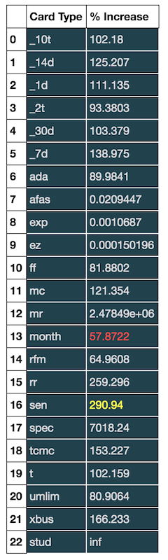

# Christian Rosado, Home Work 9
### Nov. 16, 2016

## Task 1

I worked with Jon and Dana. They were both helpful with collapsing the data cube and abstracting the insight needed for event dection. Tohether we cleaned the data cube, cretated a for loop to plot all time series, and came to the conclusion that the drop in ridership was due to Hurricane sady.

## Task 2

I worked with Jon and Dana. Together we were able to calulate the percent increase for every MTA Card Type. I also explered with customising pandas' data frame with css. Below you will see the largest steadily increase of card type usage in gold and the largest steadily decrease in rose.

## Task 3

I got help from Pooneh and Xinbu (xg656). They both helped me plot the forier transform plot and obtain the four stations with periodicity.
